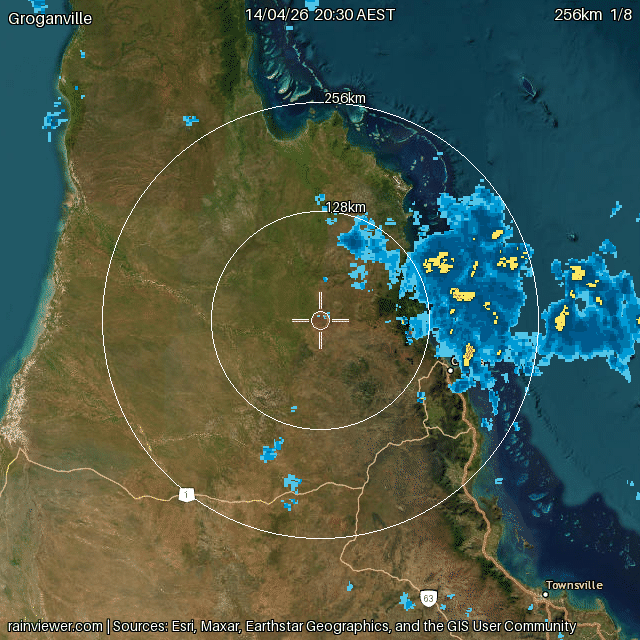
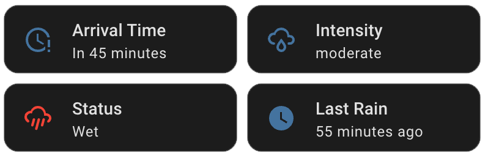

# Rain Incoming

[](https://github.com/abrainwood/home-assistant-rain-incoming/actions/workflows/ci.yml)
[](https://sonarcloud.io/summary/new_code?id=abrainwood_home-assistant-rain-incoming)
[](https://sonarcloud.io/summary/new_code?id=abrainwood_home-assistant-rain-incoming)
[](https://sonarcloud.io/summary/new_code?id=abrainwood_home-assistant-rain-incoming)
[](LICENSE)

[](https://my.home-assistant.io/redirect/hacs_repository/?owner=abrainwood&repository=home-assistant-rain-incoming&category=Integration)

> **Alpha** - this integration is under active development. The detection pipeline works and is in daily use, but we're still tuning accuracy and expanding test coverage with real-world data. The current method uses cell tracking with velocity projection (not optical flow or ML). If you try it out, we'd love your feedback - especially false positives/negatives, radar quality issues, or use cases we haven't considered. See [Discussions](https://github.com/abrainwood/home-assistant-rain-incoming/discussions) or [open an issue](https://github.com/abrainwood/home-assistant-rain-incoming/issues).

**Know before it hits.** Rain Incoming watches weather radar and tells you when rain is heading your way - before it arrives. It uses nowcasting: short-term prediction (0-60 minutes out) driven by live radar data, not forecast models. Get animated radar maps and sensors you can use to trigger automations.



*Rain rolling in off the coast - Groganville QLD, 256km view with ESRI satellite imagery*



*Sensor cards in the HA dashboard - arrival time, intensity, rain status, and last rain*

---

## 🌧️ What you get

- **Binary sensor** - is rain incoming? (`on`/`off`, use it in any automation)
- **Arrival time prediction** - when will it arrive? (based on current radar motion)
- **Intensity level** - light / moderate / heavy / extreme
- **Animated radar maps** at 3 zoom levels (64 / 128 / 256km)
- **Multi-location support** - up to 4 locations per installation
- **Works worldwide** - powered by [RainViewer](https://www.rainviewer.com/), free, no API key needed
- **Smart noise filtering** - QC pipeline handles radar artifacts so you don't get false alarms

---

## 📦 Installation

### Method 1: HACS (recommended)
[](https://github.com/hacs/integration)

1. Make sure [HACS](https://hacs.xyz) is installed
2. In HACS, click the three-dot menu (top right) and choose **Custom repositories**
3. Add `https://github.com/abrainwood/home-assistant-rain-incoming` as an **Integration**
4. Find **Rain Incoming** in the HACS list and click **Download**
5. Restart Home Assistant
6. Go to **Settings > Integrations > Add Integration** and search for **"Rain Incoming"**

### Method 2: Manual

1. Download the latest release from [GitHub](https://github.com/abrainwood/home-assistant-rain-incoming/releases)
2. Copy the `custom_components/rain_incoming` folder into your `config/custom_components/` directory
3. Restart Home Assistant
4. Go to **Settings > Integrations > Add Integration** and search for **"Rain Incoming"**

---

## ⚙️ Configuration

No YAML needed - everything is configured through the Home Assistant UI.

The map defaults to your Home Assistant home location, so for most people you just confirm the pin and hit Submit.

| Option | Default | Description |
|---|---|---|
| Location | Your HA home location | Pin on map - drag or click to adjust |
| Lookahead | 60 min | How far ahead to predict (nowcast window, 20-60 min) |
| Location name | _(optional)_ | Label shown on radar images and entity names |
| Map style | CARTO Voyager | Background map used for radar overlays |

### Changing settings after setup

**Settings > Integrations > Rain Incoming > Configure**

Changes take effect immediately on the next poll.

### Maximum number of locations

You can configure up to 4 separate rain_incoming locations per Home Assistant
installation. This limit exists because RainViewer's free tile API rate-limits
parallel tile fetching across multiple locations, and 4 is the practical
maximum without degraded performance.

If you have a use case that genuinely requires more than 4 locations, you can
either:
- Use locations with overlapping radar tiles - the tile cache is shared across
  all locations, so nearby locations have minimal additional fetch cost
- Switch to RainViewer's commercial tier and adjust the integration's
  rate-limit handling

---

## 💡 What can you do with it?

- Close a pergola cover before rain arrives
- Send a notification to bring the washing in
- Return a robot lawnmower to base before it gets soaked
- Close a pool cover
- Pause or cancel an irrigation schedule
- Alert if rain is expected during an outdoor event
- Close skylights or windows (with smart window actuators)

---

## 🔧 Example automations

> **Note:** If you gave your location a name during setup (e.g. "Home"), replace `rain_incoming` with `rain_incoming_home` in the entity IDs below. Check **Settings > Integrations > Rain Incoming** for your actual entity IDs.

### Close pergola cover - simple trigger

Uses just the binary sensor. As soon as rain is detected approaching, close the cover.

```yaml
automation:
  - alias: "Close pergola cover - rain incoming"
    trigger:
      - platform: state
        entity_id: binary_sensor.rain_incoming_imminent
        to: "on"
    action:
      - service: cover.close_cover
        target:
          entity_id: cover.pergola
```

### Return lawnmower - only for moderate+ rain within 5 minutes

Uses the intensity sensor to ignore light drizzle and the arrival time sensor to act only when rain is close. No point recalling the mower for light rain 45 minutes away.

```yaml
automation:
  - alias: "Return lawnmower - rain close and heavy enough"
    trigger:
      - platform: state
        entity_id: binary_sensor.rain_incoming_imminent
        to: "on"
    condition:
      - condition: template
        value_template: >
          {{ states('sensor.rain_incoming_intensity') in ['moderate', 'heavy', 'extreme'] }}
      - condition: template
        value_template: >
          
          {{ arrival != 'unknown' and (as_timestamp(arrival) - as_timestamp(now())) < 300 }}
    action:
      - service: vacuum.return_to_base
        target:
          entity_id: vacuum.lawnmower
```

### Bring the washing in - daytime notification with details

Uses all three sensors in the notification message to give useful context.

```yaml
automation:
  - alias: "Washing alert - rain incoming"
    trigger:
      - platform: state
        entity_id: binary_sensor.rain_incoming_imminent
        to: "on"
    condition:
      - condition: time
        after: "07:00:00"
        before: "19:00:00"
    action:
      - service: notify.mobile_app_your_phone
        data:
          title: "Rain incoming!"
          message: >
            {{ states('sensor.rain_incoming_intensity') | title }} rain expected
            
            at {{ arrival | as_timestamp | timestamp_custom('%H:%M') }}.
            Time to bring the washing in!
```

### Cancel irrigation when rain is overhead

Uses the "Wet" state (binary sensor turns on) to stop wasting water when it's already raining.

```yaml
automation:
  - alias: "Cancel irrigation - already raining"
    trigger:
      - platform: state
        entity_id: binary_sensor.rain_incoming_imminent
        to: "on"
    condition:
      - condition: template
        value_template: >
          
          {{ arrival != 'unknown' and (as_timestamp(arrival) - as_timestamp(now())) < 60 }}
    action:
      - service: switch.turn_off
        target:
          entity_id: switch.irrigation
```

---

## 📋 Entity reference

| Entity | Type | Description |
|---|---|---|
| `binary_sensor.rain_incoming_imminent` | Binary | `on` when rain is approaching or overhead, `off` when clear |
| `binary_sensor.rain_incoming_raining_now` | Binary (moisture) | `Wet` when rain is at the location (overhead), `Dry` otherwise |
| `sensor.rain_incoming_arrival_time` | Timestamp | Predicted arrival time, `unknown` when no rain incoming |
| `sensor.rain_incoming_intensity` | Sensor | Precipitation intensity: `none` / `light` / `moderate` / `heavy` / `extreme` |
| `sensor.rain_incoming_last_rain` | Timestamp | Last time rain was detected nearby |
| `image.rain_incoming_radar_64km` | Image | Animated radar map - neighbourhood scale (64km radius) |
| `image.rain_incoming_radar_128km` | Image | Animated radar map - city/regional scale (128km radius) |
| `image.rain_incoming_radar_256km` | Image | Animated radar map - state/province scale (256km radius) |

The radar images show the last several frames of radar data as an animation, with a crosshair marking your monitored location.

### Sensor attributes

The binary sensor and arrival time sensor expose these attributes for debugging and automation:

| Attribute | Description |
|---|---|
| `confidence` | `normal` (3+ frames), `degraded` (2 frames), or `unavailable` |
| `frame_count` | Number of radar frames used in the analysis |

---

## 🔍 Troubleshooting

### Confidence levels

- **normal** - 3 or more radar frames available. Detection is running at full accuracy.
- **degraded** - only 2 frames available. Detection still works but motion tracking is less reliable. This can happen when the RainViewer API is temporarily returning fewer frames.
- **unavailable** - fewer than 2 frames. Sensors will show as unavailable until more data arrives.

### Cold-start period

The integration learns your local clutter patterns over approximately 2 weeks. During this period you may see more false positives as the clutter map builds up a baseline of which radar returns are persistent noise vs real precipitation. Accuracy improves gradually as the map matures.

### False positives

Anomalous propagation (AP) is a radar artifact that can appear during clear, still nights. The QC system progressively filters these as it learns your local patterns.

### No rain detected when it's clearly raining

Check that your configured latitude and longitude are correct. The crosshair on the radar image entities shows the monitored location - verify it matches where you expect.

---

## ⚙️ How it works

Rain Incoming fetches radar composite tiles from [RainViewer](https://www.rainviewer.com/) every 10 minutes and analyses multiple frames to detect and track rain cells.

**Current detection method: cell tracking with velocity projection**

1. **Intensity thresholding** - identify precipitation pixels above a minimum dBZ equivalent
2. **Spatial filtering** - remove isolated pixels too small to be real rain cells
3. **Cell labeling** - identify distinct rain cells using connected-component analysis
4. **Centroid tracking** - match cells across consecutive frames by nearest-centroid distance
5. **Velocity estimation** - compute cell speed and direction from tracked centroids
6. **Directional coherence** - reject cells with inconsistent or random motion (likely noise)
7. **Forward projection** - project cell positions forward in 60-second steps to estimate arrival time
8. **Closing-distance fallback** - for oblique approaches where the velocity vector doesn't point at the location but the cell is consistently getting closer

A multi-stage **QC pipeline** filters radar artifacts before detection: texture analysis, temporal consistency, clutter map learning, speed sanity checks, and motion consistency scoring. Each stage contributes a confidence score that gates which pixels are trusted.

**What we're testing and tuning:**
- False positive rates in clear-sky conditions (anomalous propagation, ground clutter)
- Detection accuracy for different rain types (widespread frontal vs isolated convective)
- Arrival time accuracy across different storm speeds
- Behaviour in regions with sparse radar coverage (e.g. New Zealand, rural Australia)

**Methods we're evaluating for future versions:**
- **Hyperlocal forecast augmentation** - use hourly weather forecasts (Open-Meteo, Pirate Weather) as a complementary signal. Forecasts can warn of rain development before radar sees it (convective initiation, orographic rainfall), and extend the prediction horizon beyond radar's ~30 minute limit.
- **Dense optical flow** (Lucas-Kanade / Farneback) - velocity at every pixel instead of cell centroids, better for diffuse rain bands and frontal systems
- **Growth/decay modelling** - cells don't just move, they intensify and weaken. Currently we project static intensity forward.
- **Probabilistic output** - "70% chance of rain in 25-35 minutes" instead of binary on/off
- **PySTEPS integration** - an established open-source nowcasting library used by national weather services, offering ensemble forecasts and Lagrangian advection

We're collecting radar + ground truth data from 8 locations (AU and US) to build a backtesting harness before making detection changes - no guesswork.

For technical details, see [CONTRIBUTING.md](CONTRIBUTING.md).

---

## 🤝 Contributing

Bug reports, feature requests, and PRs are welcome. See [CONTRIBUTING.md](CONTRIBUTING.md) for how to set up a dev environment and run the test suite.

---

## Requirements

- Home Assistant 2024.1+
- Internet access (RainViewer API - free, no API key required)

---

## Attribution

**Radar data:** [RainViewer](https://www.rainviewer.com/) - free for personal and educational use with attribution. See [RainViewer API terms](https://www.rainviewer.com/api.html).

**Map tiles** (depending on selected style):

| Style | Provider | Attribution |
|---|---|---|
| CARTO Voyager _(default)_ | [CARTO](https://carto.com/) | © CARTO, © OpenStreetMap contributors |
| OpenStreetMap | [OpenStreetMap](https://www.openstreetmap.org/) | © OpenStreetMap contributors |
| OpenStreetMap Dark | [OpenStreetMap](https://www.openstreetmap.org/) | © OpenStreetMap contributors |
| ESRI Satellite Imagery | [Esri](https://www.esri.com/) | Sources: Esri, Maxar, Earthstar Geographics, and the GIS User Community |
| Dark Matter | [CARTO](https://carto.com/) | © CARTO, © OpenStreetMap contributors |

OpenStreetMap data is available under the [Open Database License](https://opendatacommons.org/licenses/odbl/).
CARTO tiles are provided under [CARTO's basemap service terms](https://carto.com/legal/).

These attributions are also displayed on every radar image rendered by the integration.

## License

[MIT](LICENSE)
