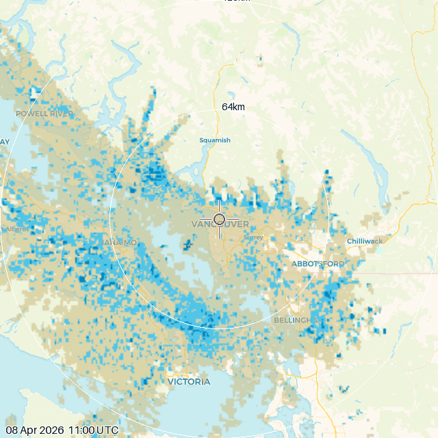

# Rain Incoming

**Know before it hits.** Rain Incoming watches weather radar and tells you when rain is heading your way - before it arrives. It uses nowcasting: short-term prediction (0-60 minutes out) driven by live radar data, not forecast models. Get animated radar maps and sensors you can use to trigger automations.



*Heavy rain approaching Vancouver - 128km view*

---

## 🌧️ What you get

- **Binary sensor** - is rain incoming? (`on`/`off`, use it in any automation)
- **Arrival time prediction** - when will it arrive? (based on current radar motion)
- **Intensity level** - light / moderate / heavy / extreme
- **Animated radar maps** at 3 zoom levels (64 / 128 / 256km)
- **Multi-location support** - up to 4 locations per installation
- **Works worldwide** - powered by [RainViewer](https://www.rainviewer.com/), free, no API key needed
- **Smart noise filtering** - QC pipeline handles radar artifacts so you don't get false alarms

---

## 📦 Installation

### Method 1: HACS (recommended)

1. Make sure [HACS](https://hacs.xyz) is installed
2. In HACS, click the three-dot menu (top right) and choose **Custom repositories**
3. Add `https://github.com/abrainwood/home-assistant-rain-incoming` as an **Integration**
4. Find **Rain Incoming** in the HACS list and click **Download**
5. Restart Home Assistant
6. Go to **Settings > Integrations > Add Integration** and search for **"Rain Incoming"**

### Method 2: Manual

1. Download the latest release from [GitHub](https://github.com/abrainwood/home-assistant-rain-incoming/releases)
2. Copy the `custom_components/rain_incoming` folder into your `config/custom_components/` directory
3. Restart Home Assistant
4. Go to **Settings > Integrations > Add Integration** and search for **"Rain Incoming"**

---

## ⚙️ Configuration

No YAML needed - everything is configured through the Home Assistant UI.

The map defaults to your Home Assistant home location, so for most people you just confirm the pin and hit Submit.

| Option | Default | Description |
|---|---|---|
| Location | Your HA home location | Pin on map - drag or click to adjust |
| Lookahead | 60 min | How far ahead to predict (nowcast window, 20-60 min) |
| Location name | _(optional)_ | Label shown on radar images and entity names |
| Map style | CARTO Voyager | Background map used for radar overlays |

### Changing settings after setup

**Settings > Integrations > Rain Incoming > Configure**

Changes take effect immediately on the next poll.

### Maximum number of locations

You can configure up to 4 separate rain_incoming locations per Home Assistant
installation. This limit exists because RainViewer's free tile API rate-limits
parallel tile fetching across multiple locations, and 4 is the practical
maximum without degraded performance.

If you have a use case that genuinely requires more than 4 locations, you can
either:
- Wait for shared global tile caching (issue #87) which will reduce per-location
  fetch cost
- Switch to RainViewer's commercial tier and adjust the integration's
  rate-limit handling

---

## 💡 What can you do with it?

- Close a pergola cover before rain arrives
- Send a notification to bring the washing in
- Return a robot lawnmower to base before it gets soaked
- Close a pool cover
- Pause or cancel an irrigation schedule
- Alert if rain is expected during an outdoor event
- Close skylights or windows (with smart window actuators)

---

## 🔧 Example automations

### Close pergola cover when rain is incoming

```yaml
automation:
  - alias: "Close pergola cover - rain incoming"
    trigger:
      - platform: state
        entity_id: binary_sensor.rain_incoming_status
        to: "on"
    action:
      - service: cover.close_cover
        target:
          entity_id: cover.pergola
```

### Return lawnmower before rain arrives

```yaml
automation:
  - alias: "Return lawnmower - rain incoming"
    trigger:
      - platform: state
        entity_id: binary_sensor.rain_incoming_status
        to: "on"
    condition:
      - condition: not
        conditions:
          - condition: state
            entity_id: sensor.rain_incoming_intensity
            state: "light"
    action:
      - service: vacuum.return_to_base
        target:
          entity_id: vacuum.lawnmower
```

### Bring the washing in

```yaml
automation:
  - alias: "Washing alert - rain incoming"
    trigger:
      - platform: state
        entity_id: binary_sensor.rain_incoming_status
        to: "on"
    condition:
      # Only alert during daytime when washing might be out
      - condition: time
        after: "07:00:00"
        before: "19:00:00"
    action:
      - service: notify.mobile_app_your_phone
        data:
          title: "Rain incoming!"
          message: >
            Rain expected to arrive at {{ states('sensor.rain_incoming_arrival_time') | as_timestamp | timestamp_custom('%H:%M') }}.
            Intensity: {{ states('sensor.rain_incoming_intensity') }}.
            Time to bring the washing in!
```

---

## 📋 Entity reference

| Entity | Type | Description |
|---|---|---|
| `binary_sensor.rain_incoming_status` | Binary | `on` when rain is approaching or overhead |
| `sensor.rain_incoming_arrival_time` | Timestamp | Predicted arrival time, `unknown` when no rain incoming |
| `sensor.rain_incoming_intensity` | Sensor | Precipitation intensity: none / light / moderate / heavy / extreme |
| `sensor.rain_incoming_last_rain` | Timestamp | Last time rain was detected nearby |
| `image.rain_incoming_radar_64km` | Image | Animated radar map - neighbourhood scale (64km radius) |
| `image.rain_incoming_radar_128km` | Image | Animated radar map - city/regional scale (128km radius) |
| `image.rain_incoming_radar_256km` | Image | Animated radar map - state/province scale (256km radius) |

The radar images show the last several frames of radar data as an animation, with a crosshair marking your monitored location.

### Sensor attributes

The binary sensor and arrival time sensor expose these attributes for debugging and automation:

| Attribute | Description |
|---|---|
| `confidence` | `normal` (3+ frames), `degraded` (2 frames), or `unavailable` |
| `frame_count` | Number of radar frames used in the analysis |

---

## 🔍 Troubleshooting

### Confidence levels

- **normal** - 3 or more radar frames available. Detection is running at full accuracy.
- **degraded** - only 2 frames available. Detection still works but motion tracking is less reliable. This can happen when the RainViewer API is temporarily returning fewer frames.
- **unavailable** - fewer than 2 frames. Sensors will show as unavailable until more data arrives.

### Cold-start period

The integration learns your local clutter patterns over 12+ hours. During this period you may see slightly reduced accuracy.

### False positives

Anomalous propagation (AP) is a radar artifact that can appear during clear, still nights. The QC system progressively filters these as it learns your local patterns.

### No rain detected when it's clearly raining

Check that your configured latitude and longitude are correct. The crosshair on the radar image entities shows the monitored location - verify it matches where you expect.

---

## ⚙️ How it works

Incoming Rain fetches radar composite data from RainViewer and analyses multiple frames to track rain cell motion and project whether any cells will reach your location within the lookahead window. A QC pipeline filters out radar noise - things like ground clutter and anomalous propagation - using spatial, temporal, and directional coherence checks. Rain is reported as incoming if it's overhead or projected to arrive within your configured window.

For technical details, see [CONTRIBUTING.md](CONTRIBUTING.md).

---

## 🤝 Contributing

Bug reports, feature requests, and PRs are welcome. See [CONTRIBUTING.md](CONTRIBUTING.md) for how to set up a dev environment and run the test suite.

---

## Requirements

- Home Assistant 2024.1+
- Internet access (RainViewer API - free, no API key required)

---

## Attribution

Radar data provided by [RainViewer](https://www.rainviewer.com/). Free for personal and educational use with attribution.

## License

[MIT](LICENSE)
